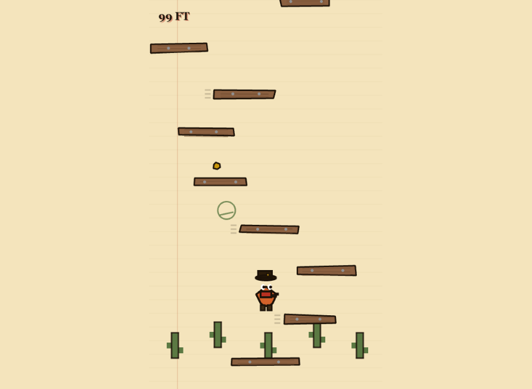

# Billy Bouncer

  <strong>A hand-drawn western endless jumper built in one HTML file with Phaser 3.</strong>

  Billy Bouncer takes the core climb-forever rhythm of a doodle-style vertical platformer and drops it into a frontier sketchbook:
  parchment paper, inked platforms, outlaw energy, procedural audio, and a whole lot of stubborn upward momentum.

  <a href="https://billy-bouncer.vercel.app"><strong>Play live on Vercel</strong></a>

  

## What It Is

`Billy Bouncer` is a fully playable endless vertical jumper inspired by the feel of Doodle Jump, rebuilt with a custom western/frontier skin and a deliberately constrained tech stack:

- one `index.html`
- Phaser 3 from CDN
- Arcade physics
- no build tools
- no asset folders
- no image files for the game itself
- no audio files

Everything in the playable game is drawn procedurally with canvas and Phaser graphics, and the sound effects are synthesized in code through the Web Audio API.

## Core Feel

The game is built around the classic loop:

- Billy jumps automatically the instant he lands
- the player only controls left and right movement
- the camera chases upward and never drops back down
- the world keeps generating higher as the run continues
- falling below the visible camera view ends the run
- left and right edges wrap, so escape routes stay open and movement stays expressive

The balancing work in this version also keeps the run fair:

- platform spacing respects reachable jump distances
- early-game layouts stay readable and playable
- enemy spawning avoids walling off the full route
- high-launch power-ups grant temporary protection during their forced travel

## Frontier Style

The visual direction leans hard into a doodled wanted-poster notebook:

- parchment-paper background with ruled lines and a red margin line
- thick ink outlines and flat cel-shaded colors
- hand-drawn platform silhouettes with intentional corner wobble
- altitude-based backgrounds that shift from desert parchment into mesa dusk, lantern-lit dark, and deep-indigo night
- a bandit hero with a big hat, poncho, bandana, boots, and reactive animation states

The goal was not just "western colors," but a game that feels like somebody's outlaw notebook came alive.

## What's In The Game

### Platforms

- stable wooden platforms
- horizontal movers
- vertical movers
- fragile cracking platforms
- vanishing platforms
- exploding platforms
- platform-mounted springs

### Enemies and Hazards

- rattlesnakes
- vultures
- armored sheriff heavies
- steampunk dirigible/UFO abductors
- black holes with gravitational pull

### Power-Ups

- spring burst
- jetpack
- rocket
- propeller hat
- spring boots
- shield
- monster repellent

### Collectibles and Combat

- gold nuggets
- silver coins
- mouse-aimed pellets
- spacebar straight shot
- enemy stomps
- procedural impact and death effects

## Controls

### Desktop

- `Left Arrow` / `A` - move left
- `Right Arrow` / `D` - move right
- `Mouse Click` - shoot toward cursor
- `Space` - start from menu / shoot upward in-game

Billy handles jumping on his own. Your whole job is route choice, horizontal control, timing, and survival.

## Tech Notes

This repo is intentionally tiny:

- [index.html](./index.html) contains the full game
- [docs/billy-bouncer-gameplay.png](./docs/billy-bouncer-gameplay.png) is the README screenshot

The game is designed to run immediately by opening `index.html` in Chrome, and it also deploys cleanly to static hosting.

## Running It Locally

You have two easy options:

1. Open [index.html](./index.html) directly in Chrome.
2. Visit the deployed version at [billy-bouncer.vercel.app](https://billy-bouncer.vercel.app).

No install step is required.

## Deployment

This project is already deployed on Vercel:

- Live URL: [https://billy-bouncer.vercel.app](https://billy-bouncer.vercel.app)

Because the whole game is static and self-contained, deployment is pleasantly boring: ship the file, let it run.

## Why This Repo Exists

This was built as a focused experiment in making a rich arcade game without hiding behind a big asset pipeline:

- procedural art instead of imported sprites
- procedural sound instead of packaged audio
- browser-openable delivery instead of a local dev stack
- tuned gameplay instead of a one-off toy

That constraint is part of the charm. The whole thing stays inspectable.

## Snapshot

If you want the one-sentence version:

> `Billy Bouncer` is a western sketchbook endless jumper that plays instantly, climbs forever, and lives entirely inside one HTML file.
